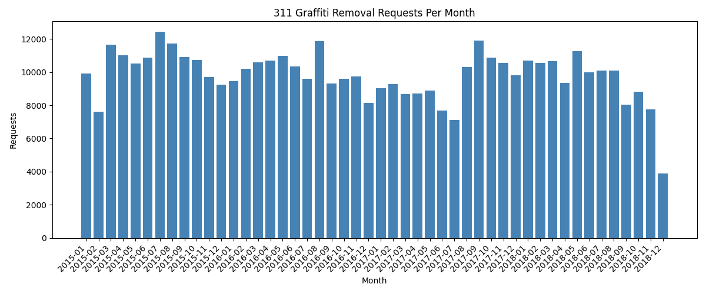
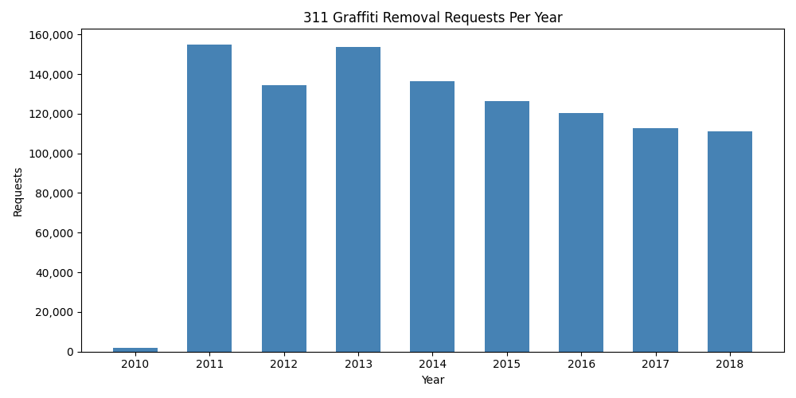

.. index:: Chicago Data Portal; case study, 311 graffiti; case study,
           open data; civic dataset, data pipeline; fetch-load-analyze-visualize,
           urllib.request; download, csv.DictReader; real data
   ACM-IEEE CS2013; IM1 Information Management Concepts
   ACM-IEEE CS2023; IM1 Information Management Concepts
   ACM-IEEE CS2013; SDF2 Fundamental Programming Concepts
   ACM-IEEE CS2023; SDF2 Fundamental Programming Concepts

.. _Case-Study-311-Graffiti:

Case Study: Chicago 311 Graffiti Data
=======================================

.. note::
   *Source:* Adapted from `scalaworkshop
   <https://github.com/gkthiruvathukal/scalaworkshop>`_
   by George K. Thiruvathukal and Konstantin Läufer.  Original Scala implementation at
   `introds-scala-examples/311-case-study-scala
   <https://github.com/LoyolaChicagoBooks/introds-scala-examples/tree/main/311-case-study-scala>`_.
   Data published by the City of Chicago under the Chicago Data Portal
   open data licence.

**Problem.** The City of Chicago publishes every graffiti-removal
request submitted through its 311 system as open data.  Can we
download that dataset, explore its structure, and find patterns — which
ZIP codes generate the most requests?  How does volume change by
season?

This case study builds a complete data pipeline in Python using only
the standard library plus ``matplotlib``:

.. code-block:: none

   Fetch → Load → Aggregate → Filter → Visualize

The dataset URL is:

.. code-block:: none

   https://data.cityofchicago.org/api/views/hec5-y4x5/rows.csv?accessType=DOWNLOAD

.. index:: urllib.request.urlretrieve; 311, data fetching; civic data

Step 1 — Fetch
--------------

``urllib.request.urlretrieve`` streams the file directly to disk
without loading the entire response into memory — important for a
dataset that can exceed 100 MB:

.. literalinclude:: ../../examples/introcs-python/internet_data/graffiti.py
   :language: python
   :start-after: # start: fetch_graffiti
   :end-before: # end: fetch_graffiti

.. code-block:: python

   fetch_graffiti("311_graffiti.csv")

Output:

.. code-block:: none

   Downloading to 311_graffiti.csv ...
   Done.

.. index:: csv.DictReader; civic data, data inspection; CSV

Step 2 — Load and Inspect
--------------------------

``csv.DictReader`` turns each row into a dictionary keyed by the
column headers.  A ``limit`` parameter lets you preview a few rows
before processing the full file:

.. literalinclude:: ../../examples/introcs-python/internet_data/graffiti.py
   :language: python
   :start-after: # start: load_graffiti
   :end-before: # end: load_graffiti

.. code-block:: python

   rows = load_graffiti("311_graffiti.csv", limit=3)
   for row in rows:
       print(row["Creation Date"], row["Status"], row["ZIP Code"])

Output (representative):

.. code-block:: none

   01/02/2024  Completed  60614
   01/02/2024  Completed  60647
   01/03/2024  Open       60618

The dataset includes columns for creation and completion dates, street
address, ZIP code, latitude/longitude, ward, and police district.

.. index:: collections.Counter; 311 aggregation, group-by; ZIP code

Step 3 — Aggregate
-------------------

``collections.Counter`` counts how many requests fall under each
value of a given column — here, ZIP code:

.. literalinclude:: ../../examples/introcs-python/internet_data/graffiti.py
   :language: python
   :start-after: # start: aggregate_graffiti
   :end-before: # end: aggregate_graffiti

.. code-block:: python

   for zip_code, count in aggregate_graffiti("311_graffiti.csv", top=5):
       print(f"{zip_code:10s}  {count:6,}")

Output (representative):

.. code-block:: none

   60614       4,821
   60647       4,203
   60618       3,977
   60622       3,840
   60625       3,512

.. index:: datetime.strptime; 311 filtering, date range filtering; status filter

Step 4 — Filter
----------------

Real datasets need filtering before analysis.  This function returns
only rows matching a given status whose creation date falls within a
specified range:

.. literalinclude:: ../../examples/introcs-python/internet_data/graffiti.py
   :language: python
   :start-after: # start: filter_graffiti
   :end-before: # end: filter_graffiti

The ``Creation Date`` column uses ``MM/DD/YYYY`` format, so
``datetime.strptime`` with ``"%m/%d/%Y"`` parses it.  Rows with
unparseable dates are skipped with ``continue``.

.. code-block:: python

   matches = filter_graffiti("311_graffiti.csv",
                              status="Completed",
                              start="2015-01-01",
                              end="2015-01-31")
   print(f"{len(matches):,} completed requests in January 2015")

Output:

.. code-block:: none

   9,480 completed requests in January 2015

.. index:: matplotlib; 311 bar chart, bar chart; monthly trend

Step 5 — Visualize
-------------------

Grouping by year-month and plotting a bar chart reveals the seasonal
pattern in graffiti removal activity.  Requests dip in winter (cold
weather means fewer outdoor surfaces are tagged) and peak in late
spring and summer:

.. literalinclude:: ../../examples/introcs-python/internet_data/graffiti.py
   :language: python
   :start-after: # start: visualize_graffiti
   :end-before: # end: visualize_graffiti

.. note::

   The Chicago 311 graffiti dataset on the Data Portal covers **2011–2018**.
   The portal stopped updating this particular view after that period; more
   recent 311 data is published under a different endpoint.  When working
   with open datasets, always check the date range before drawing conclusions.

.. code-block:: python

   visualize_graffiti("311_graffiti.csv", "graffiti_trend.png",
                      year_start=2015, year_end=2018)

Output:

.. code-block:: none

   Saved graffiti_trend.png

Install ``matplotlib`` first if needed:

.. code-block:: none

   pip install matplotlib

   Monthly graffiti removal requests from the Chicago 311 open dataset (2015–2018).

To see the full span of the dataset at a glance, plot annual totals
across all years:

.. literalinclude:: ../../examples/introcs-python/internet_data/graffiti.py
   :language: python
   :start-after: # start: visualize_by_year
   :end-before: # end: visualize_by_year

.. code-block:: python

   visualize_by_year("311_graffiti.csv", "graffiti_by_year.png")

Output:

.. code-block:: none

   Saved graffiti_by_year.png

   Total graffiti removal requests per year (2010–2018).  The 2010 bar
   is partial (data begins mid-year); 2011–2018 show full annual volumes.

.. index:: civic data; equity analysis, 311; interpretation

What the Data Reveals
----------------------

311 reports are not merely complaints — they are a form of civic
participation.  Analysing this data over time and across ZIP codes
surfaces questions about equity: are removal requests serviced equally
across neighbourhoods?  Are response times consistent?  Which wards
have the highest volume, and why?

This dataset is a starting point.  The same pipeline — fetch, load,
aggregate, filter, visualise — applies to any of the hundreds of
other datasets published on the Chicago Data Portal.

Challenges
----------

1. Modify ``aggregate_graffiti`` to group by ``"Ward"`` instead of
   ``"ZIP Code"``.  Which ward has the most graffiti removal requests?

2. Write a function ``average_completion_days(filename)`` that returns
   the average number of days between ``"Creation Date"`` and
   ``"Completion Date"`` for completed requests.  Skip rows where
   either date is missing or unparseable.

3. The dataset includes ``"Latitude"`` and ``"Longitude"`` columns.
   Write a function that filters rows to those within a bounding box
   (min/max lat/lon) and returns the count.  Use it to count requests
   in a neighbourhood of your choice.

4. Extend ``visualize_graffiti`` to overlay a 12-month rolling average
   line on top of the monthly bars.

5. Download the 311 Pothole Reports dataset (view ID ``7as2-ds3y``)
   and compare monthly volumes for graffiti and potholes side-by-side
   on a single chart using two sets of bars.
