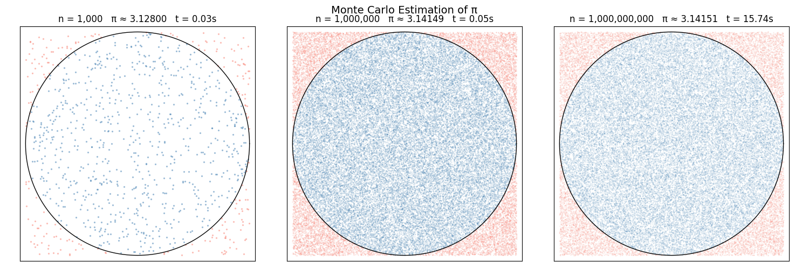

.. index:: Monte Carlo simulation; case study, pi estimation; case study,
           random sampling; area estimation, darts; Monte Carlo,
           pandas; DataFrame, pandas; to_csv
   ACM-IEEE CS2013; AL2 Algorithmic Strategies
   ACM-IEEE CS2023; AL2 Algorithmic Strategies
   ACM-IEEE CS2013; DS6 Discrete Probability
   ACM-IEEE CS2023; DS6 Discrete Probability

.. _Case-Study-Monte-Carlo:

Case Study: Monte Carlo Simulation
====================================

.. note::
   *Source:* Adapted from `scalaworkshop
   <https://github.com/gkthiruvathukal/scalaworkshop>`_
   by George K. Thiruvathukal and Konstantin Läufer.  Original Scala implementation at
   `introds-scala-examples/montecarlo-scala
   <https://github.com/LoyolaChicagoBooks/introds-scala-examples/tree/main/montecarlo-scala>`_.

**Problem.** How do you estimate the value of π without using any
formula?  One answer: throw darts randomly at a square and count how
many land inside the inscribed circle.

This is a *Monte Carlo simulation* — a technique that uses random
sampling to estimate a result that would be hard or impossible to
compute analytically.  The method generalises to integration, risk
analysis, physics, and many other domains.

.. index:: Monte Carlo method; geometry, unit circle; inscribed square

The Setup
----------

Draw a 2×2 square centred at the origin and inscribe a unit circle
(radius 1) inside it.

.. code-block:: none

   Area of square  = 4
   Area of circle  = π

   P(random point lands inside circle) = π / 4

   Therefore: π ≈ 4 × (points inside) / (total points)

The more points you throw, the closer the estimate converges to the
true value.

.. index:: generate_darts; case study, random.uniform; case study

Step 1 — Generate the Darts
-----------------------------

Each dart is a random point (x, y) with x and y each drawn uniformly
from [-1, 1].  A dart is *inside* the circle when x² + y² ≤ 1:

.. literalinclude:: ../../examples/introcs-python/simulation/monte_carlo.py
   :language: python
   :start-after: # start: generate_darts
   :end-before: # end: generate_darts

The function returns a DataFrame with columns ``x``, ``y``, and
``inside``, so the data is self-describing and can be saved or
analysed with standard pandas operations.

.. index:: save_darts; CSV, pandas.DataFrame.to_csv; simulation

Step 2 — Save the Darts to a File
-----------------------------------

``DataFrame.to_csv`` writes the DataFrame to disk in one call.
Passing ``index=False`` omits the row numbers that pandas adds by
default, keeping the file clean and portable:

.. literalinclude:: ../../examples/introcs-python/simulation/monte_carlo.py
   :language: python
   :start-after: # start: save_darts
   :end-before: # end: save_darts

.. code-block:: python

   darts = generate_darts(100_000)
   save_darts(darts, "darts.csv")

Output:

.. code-block:: none

   $ head -3 darts.csv
   x,y,inside
   0.327450182,-0.645223491,True
   -0.812774563,0.203948217,True

Separating generation from analysis is a deliberate design choice.
Once the darts are on disk you can share the file, re-run the
analysis without re-generating, or load the same dataset in a
completely different script.

.. index:: load_darts; pandas.read_csv, DataFrame; round-trip

Step 3 — Load the Darts from a File
--------------------------------------

``pd.read_csv`` reconstructs the DataFrame from the saved file.
Because the ``inside`` column was written as ``True``/``False``,
pandas reads it back as a boolean column automatically:

.. literalinclude:: ../../examples/introcs-python/simulation/monte_carlo.py
   :language: python
   :start-after: # start: load_darts
   :end-before: # end: load_darts

.. code-block:: python

   darts = load_darts("darts.csv")
   print(darts.shape, darts.dtypes)

Output:

.. code-block:: none

   (100000, 3)
   x        float64
   y        float64
   inside      bool
   dtype: object

.. index:: estimate_pi; case study, pandas.Series.sum; Monte Carlo

Step 4 — Estimate π
---------------------

``estimate_pi`` works identically whether the DataFrame came from
``generate_darts`` or ``load_darts`` — both produce the same shape
and column types.  Because ``darts["inside"]`` is a boolean Series,
``.sum()`` counts the ``True`` values directly:

.. literalinclude:: ../../examples/introcs-python/simulation/monte_carlo.py
   :language: python
   :start-after: # start: estimate_pi
   :end-before: # end: estimate_pi

With 100 000 darts:

.. code-block:: python

   import math
   darts = load_darts("darts.csv")
   print(f"π ≈ {estimate_pi(darts):.6f}  (true: {math.pi:.6f})")

Output:

.. code-block:: none

   π ≈ 3.141440  (true: 3.141593)

.. index:: convergence; law of large numbers, error rate; Monte Carlo

Step 5 — Measure Convergence
------------------------------

How many darts do you need?  The error shrinks roughly as 1/√n — each
tenfold increase in darts buys roughly one more correct decimal place
at the cost of ten times the work:

.. literalinclude:: ../../examples/introcs-python/simulation/monte_carlo.py
   :language: python
   :start-after: # start: convergence
   :end-before: # end: convergence

.. code-block:: python

   convergence_table([100, 1_000, 10_000, 100_000, 1_000_000])

Output (varies due to randomness — representative run):

.. code-block:: none

            n    π estimate       error
   --------------------------------------
          100      3.120000    0.021593
        1,000      3.144000    0.002407
       10,000      3.138800    0.002793
      100,000      3.141440    0.000153
    1,000,000      3.141612    0.000019

.. index:: matplotlib; Monte Carlo scatter plot

Step 6 — Visualize
-------------------

A scatter plot makes the geometry tangible: blue dots inside the
circle, red dots in the corners.

.. literalinclude:: ../../examples/introcs-python/simulation/monte_carlo_plot.py
   :language: python
   :start-after: # start: plot_darts
   :end-before: # end: plot_darts

.. code-block:: python

   from monte_carlo import generate_darts
   darts = generate_darts(20_000)
   plot_darts(darts, 'darts.png')

Install ``matplotlib`` first if needed:

.. code-block:: none

   pip install matplotlib

.. index:: Monte Carlo; convergence grid, convergence; visualization

Convergence at a Glance
^^^^^^^^^^^^^^^^^^^^^^^^

The grid below shows how the estimate and the scatter of darts change
as n grows across three orders of magnitude.  Each panel title shows
the dart count, the estimated value of π, and the time taken to
generate that panel.

For large n, generating all darts at once would require tens of gigabytes
of memory.  Instead, ``numpy`` is used to generate and count darts in
chunks, keeping peak memory around 160 MB regardless of n:

.. literalinclude:: ../../examples/introcs-python/simulation/monte_carlo_plot.py
   :language: python
   :start-after: # start: sample_and_estimate
   :end-before: # end: sample_and_estimate

``plot_convergence_grid`` calls this for each panel, then plots the
display sample:

.. literalinclude:: ../../examples/introcs-python/simulation/monte_carlo_plot.py
   :language: python
   :start-after: # start: plot_convergence_grid
   :end-before: # end: plot_convergence_grid

.. code-block:: python

   plot_convergence_grid([1_000, 1_000_000, 1_000_000_000],
                          'convergence_grid.png')

   Monte Carlo dart plots at n = 1 000, 1 000 000, and 1 000 000 000.
   The estimate of π improves with each order of magnitude; the timing
   shows the cost of that precision.

.. index:: Monte Carlo; applications

Where the Method Is Used
-------------------------

Monte Carlo techniques appear across computing and science:

- **Finance** — option pricing, Value at Risk
- **Physics** — particle transport, nuclear reactions
- **Climate modelling** — uncertainty quantification
- **Computer graphics** — path tracing for photorealistic rendering
- **Machine learning** — Bayesian inference, dropout regularisation

The idea is always the same: replace an exact but intractable
computation with a large number of cheap random samples.

Challenges
----------

1. Run ``convergence_table([100, 1_000, 10_000, 100_000])`` several
   times.  Does the error decrease monotonically on every run?  Explain
   why or why not.

2. Add a ``seed`` parameter to ``generate_darts`` and pass it to
   ``random.seed`` before the loop.  Verify that two calls with the
   same seed produce identical results.

3. The unit circle has area π.  Use the same technique to estimate the
   area of a diamond with vertices at (±1, 0) and (0, ±1).  What
   should the answer be?

4. Generate two sets of darts with different seeds and save each to
   its own CSV file.  Load both files with ``load_darts``, concatenate
   the DataFrames with ``pd.concat``, and compute ``estimate_pi`` on
   the combined dataset.  Does combining datasets improve the estimate?

5. Plot how the absolute error changes as n increases from 100 to
   1 000 000 (use a logarithmic x-axis).  Does the slope of the error
   curve match the expected −½ on a log-log scale?
