.. index:: computing history, numbers; history, zero; history, abacus, quipu, ENIAC, Atanasoff-Berry Computer, ABC, memex, algorithm; etymology
   ACM-IEEE CS2013; SP8 History
   ACM-IEEE CS2023; SP8 History

.. _Computing-History:

Episodes in Computing History
==============================

.. note::
   This chapter is still very preliminary and is not intended to be exhaustive.
   It is based primarily on the author's own published works:

   - George K. Thiruvathukal, "Episodes in Computing History — Salon Talk,"
     Loyola University Chicago, 2025.
     `ecommons.luc.edu/cs_facpubs/417 <https://ecommons.luc.edu/cs_facpubs/417/>`__
     (`doi:10.6084/m9.figshare.29632070 <https://doi.org/10.6084/m9.figshare.29632070>`__) — primary source.

   - George K. Thiruvathukal and David B. Dennis, "Computer Science and Cultural History:
     A Dialogue," CESTEMER Conference, Goodman Theater, Chicago, September 2017.
     `ecommons.luc.edu/history_facpubs/42 <https://ecommons.luc.edu/history_facpubs/42/>`__

   - George K. Thiruvathukal, "Artificial Intelligence and/or Machine Learning (AI &| ML),"
     Invited Panel Discussion, Loyola University Retiree Association (LUCRA), March 2024.
     `ecommons.luc.edu/cs_facpubs/378 <https://ecommons.luc.edu/cs_facpubs/378/>`__
     (`doi:10.6084/m9.figshare.25955026 <https://doi.org/10.6084/m9.figshare.25955026>`__)

   - George K. Thiruvathukal, Editor in Chief, *Computing in Science and Engineering*
     (IEEE/AIP), 2013–2016. A mini-history of computing was among the editorial projects
     completed during this tenure.

The story of computing does not begin with electricity, transistors, or
programming languages. It begins with the far older and more fundamental human
obsession with counting, calculating, and communicating. This chapter traces
that story — from the first scratches on bone to the stored-program computer —
as a series of episodes, each one building on what came before.

Numbers and Calculation
-----------------------

.. index:: tally sticks, Mesopotamia; number system, counting; early history

Tally Sticks and Early Counting
^^^^^^^^^^^^^^^^^^^^^^^^^^^^^^^^

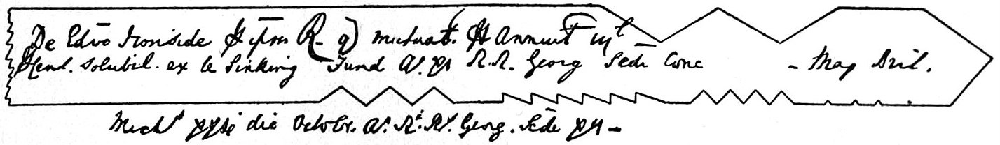

   A carved reindeer antler with tally marks from La Madeleine, France
   (c. 15,000–11,500 BCE) — one of humanity's earliest known recording devices,
   predating writing by thousands of years.
   *Source:* Ryan Somma /
   `Wikimedia Commons <https://commons.wikimedia.org/wiki/File:Carved_reindeer_antler_with_tally_marks_(4697848661).jpg>`__,
   CC BY-SA 2.0.

Around 4000 BCE, traders in the Mesopotamian city of Uruk made a remarkable
discovery: the same number could stand for ten sheep, ten bags of grain, or
ten talents of copper. The quantity and the thing being counted were
separable. That abstraction — number as an independent concept — is the
foundation of everything that follows.

By about 3000 BCE, Egyptian tallies grouped items in tens, then regrouped at a
hundred, and again at a thousand. The tally stick, a notched piece of bone or
wood, was one of humanity's earliest recording devices. Versions of it were
used continuously across cultures for millennia, and Roman numerals are thought
by some scholars to have descended directly from tally-stick notches: the X for
ten, for instance, originated as a tally mark of four strokes crossed by a
diagonal, and one half of that X became the V for five. The word *calculus*
itself is Latin for *a small stone used in reckoning* — the pebbles people once
moved across counting boards to track quantities.

.. index:: hieroglyphic numbers, Egyptian numerals; pictographic system

Hieroglyphic Numbers and Pictographic Systems
^^^^^^^^^^^^^^^^^^^^^^^^^^^^^^^^^^^^^^^^^^^^^

The Egyptians went further, devising a pictographic system in use from roughly
3200 BCE to 400 CE. Each power of ten received its own symbol: a vertical stick
for one, an arch for ten, a coiled rope for a hundred, a lotus flower for a
thousand, a finger pointing skyward for ten thousand, a tadpole drawn from the
Nile for a hundred thousand, and a man with arms raised to heaven for a million.
The system was expressive but cumbersome — to write 999 you needed twenty-seven
separate signs — and it had no symbol for zero.

.. index:: Roman numerals, zero; absent from Roman system

Roman Numerals
^^^^^^^^^^^^^^

The Romans adapted and extended the tally tradition. Their numerals are
alphabetical in appearance but did not originate that way: early artifacts show
that the symbol for ten was a crossed tally mark, not a letter. Roman numerals
are notable above all for what they lack: zero. Without a placeholder for an
unused position, calculation is laborious. Try multiplying XLVII by MCXIII and
the limitation becomes immediately apparent.

The Greeks adapted their alphabet for numerals, and the Romans followed with
their own alphabetical-looking symbols. But it was a tradition far to the east
that would supply the missing ingredient.

.. index::
   single: al-Khowarizmi, Muhammad ibn Musa; House of Wisdom
   House of Wisdom; Baghdad
   algebra; etymology
   algorithm; etymology

The House of Wisdom and Al-Khowarizmi
^^^^^^^^^^^^^^^^^^^^^^^^^^^^^^^^^^^^^^

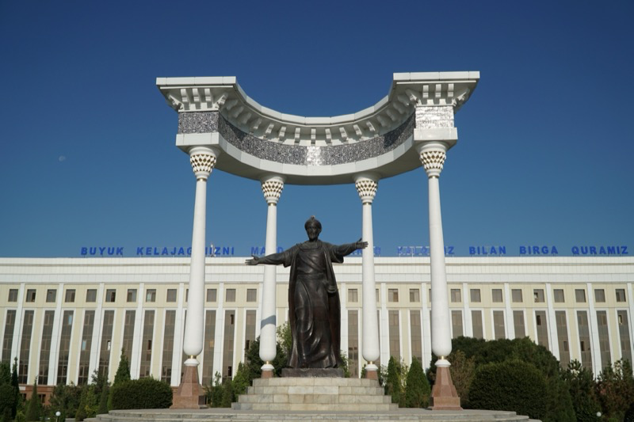

   Statue of Muhammad ibn Musa al-Khwarizmi in Urgench, Uzbekistan — the
   mathematician whose Latinized name gave us the word *algorithm*.
   *Source:* Adam Harangozó / `Wikimedia Commons <https://commons.wikimedia.org/wiki/File:Statue_of_Muhammad_ibn_Musa_al-Khwarizmi_in_Urgench.jpg>`__,
   CC BY-SA 4.0.

In 800 CE, Caliph Al-Mamun established *Bayt al-Hikmah* — the House of Wisdom
— in Baghdad. Scholars were dispatched to translate the accumulated scientific
knowledge of Greece, preserved in the libraries of Constantinople, into Arabic.
This transmission of ancient learning set the stage for an extraordinary
flowering of mathematics and science.

Among the scholars working in this tradition was Abu Jafar Mohammed Ibn Musa
Al-Khowarizmi, born around 780 CE in Khiva (present-day Uzbekistan). His
*Algebra* was the first systematic treatment of the solution of linear and
quadratic equations — earning him the title father of algebra. He used the Hindu
numeral system and the decimal place-value system, and his work spread
throughout Europe via Arab traders. Two words in everyday use today carry his
memory: *algorithm* derives from the Latinization of his name, and *algebra*
from the title of his book, *Al-Jabr*.

.. index::
   Hindu-Arabic numerals
   zero; Chaturbhuj Temple inscription
   single: Boole, George; boolean logic
   boolean logic; computing foundation

Hindu-Arabic Notation and the Gift of Zero
^^^^^^^^^^^^^^^^^^^^^^^^^^^^^^^^^^^^^^^^^^^

The numeral system that Al-Khowarizmi used originated in India. Indian
mathematicians used horizontal tallies for one, two, and three, and special
symbols for four through nine. Around 600 CE they introduced place value: rather
than writing the equivalent of 100 + 80 + 7, they simply wrote 187, with the
position of each digit encoding its magnitude. Nine digits plus a symbol for
zero — probably derived from astronomers' practice of marking empty positions —
was sufficient to represent any number.

The oldest undisputed written zero appears in a stone inscription dated 876 CE
at the Chaturbhuj Temple in Madhya Pradesh, India. Arab traders carried the
system west, where it became known simply as Arabic numerals. This system,
combined with George Boole's boolean logic of 1854 — which reduced all logical
reasoning to true and false, one and zero — provides the complete mathematical
foundation for every computer ever built.

.. index:: base sixty, sexagesimal system, Mesopotamia; base-60

The Mesopotamians and Base Sixty
^^^^^^^^^^^^^^^^^^^^^^^^^^^^^^^^^^

Not all ancient number systems were base ten. The Mesopotamians, around 3000
BCE, used a system based on sixty — the sexagesimal system. Astronomers found it
extraordinarily useful because sixty has many factors, making division clean.
Its influence endures invisibly in modern life: sixty seconds in a minute, sixty
minutes in an hour, and 360 degrees in a full circle all descend directly from
Mesopotamian counting practice. Ptolemy's *Almagest*, the great mathematical and
astronomical treatise of the second century CE, drew on this system throughout.

Nascent Computing Attempts
--------------------------

.. index:: quipu, khipu, Inca Empire; information encoding

The Quipu of the Inca Empire
^^^^^^^^^^^^^^^^^^^^^^^^^^^^^^

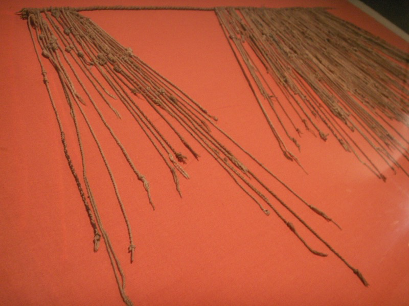

   A quipu — knotted, colored cords used by the Inca Empire for census records,
   tax accounting, and long-distance communication.
   *Source:* Jorge Mori / `Wikimedia Commons <https://commons.wikimedia.org/wiki/File:Quipu.JPG>`__,
   Public Domain (CC0).

Across the Atlantic, the Inca Empire and its predecessors developed a
completely different recording technology. The quipu (also spelled khipu)
consisted of colored, spun, and plied threads of llama or alpaca hair, or
cotton cord, with numeric and other values encoded by knots tied in a base-ten
positional system. Quipus were used for census counts, tax accounting, and
record-keeping across a vast empire. They are a vivid reminder that information
encoding admits many physical forms.

.. index:: abacus; history, suanpan

The Abacus
^^^^^^^^^^^

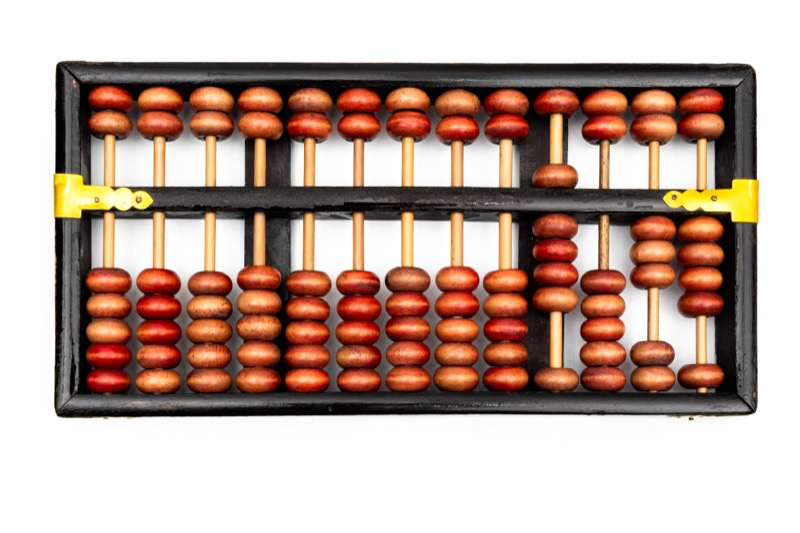

   A Chinese suanpan abacus — the primary calculation aid across Asia and the
   Mediterranean for millennia. This example encodes the number 9,034.
   *Source:* Felix Winkelnkemper / `Wikimedia Commons <https://commons.wikimedia.org/wiki/File:Chinese_Suanpan_Abacus.jpg>`__,
   CC BY-SA 4.0.

The abacus, an early form of beads on wires, appeared in China around 3000 BCE.
Its name derives from the Semitic word *abaq*, meaning dust — an allusion to the
counting boards of antiquity on which pebbles or sand could be moved to track
calculations. For millennia the abacus was the primary calculation aid across
Asia and the Mediterranean, and skilled users could perform arithmetic at
remarkable speed.

.. index:: finger reckoning, digit; etymology

Finger Reckoning
^^^^^^^^^^^^^^^^^

Before the abacus, and long alongside it, humans reckoned on their fingers. The
word *digit* preserves this history: it comes from the Latin *digitus*, meaning
finger or toe, and its numerical sense arose because numerals under ten were
counted on fingers. Medieval practitioners of finger reckoning could represent
numbers up to nine thousand using elaborate configurations of both hands.
Educated people memorized multiplication tables up to five times five; for
larger products they used systematic finger configurations and addition to
derive the rest.

.. index::
   single: Napier, John; logarithms
   Napier's Bones
   slide rule
   single: Schickard, Wilhelm; mechanical calculator
   single: Oughtred, William; slide rule

Napier's Bones and the Slide Rule
^^^^^^^^^^^^^^^^^^^^^^^^^^^^^^^^^^^

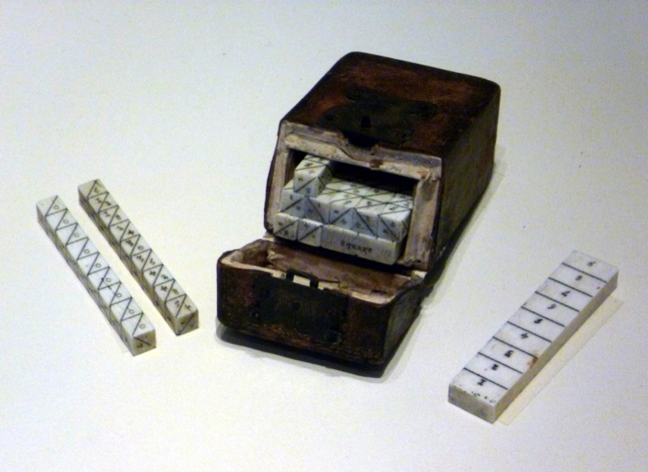

   Napier's Bones (c. 1650, ivory) at the National Museum of Scotland — numbered
   rods that reduced multiplication to reading diagonal sums.
   *Source:* Kim Traynor / `Wikimedia Commons <https://commons.wikimedia.org/wiki/File:Napier%27s_Bones.JPG>`__,
   CC BY-SA 3.0.

By the seventeenth century the tools of calculation were becoming more
sophisticated. John Napier (1550–1617), best known for inventing logarithms,
also devised a set of numbered rods — Napier's Bones — that reduced
multiplication to the much simpler operation of reading diagonal sums. His
*Rabdologia* of 1617 described the method in detail. Wilhelm Schickard
(1592–1635) took Napier's bones a step further, mounting them on cylinders with
gears and a carry mechanism to build one of the earliest mechanical calculators,
though no original example survives.

Napier's logarithms also gave rise to the slide rule. Edmund Gunter created his
Line of Numbers in 1620; William Oughtred (c. 1574–1660) then placed two such
scales alongside each other, producing the circular slide rule in 1622 and the
familiar linear form shortly after. Engineers relied on the slide rule for
precise calculation until pocket electronic calculators arrived in the 1970s.

.. index::
   single: Pascal, Blaise; Pascaline
   Pascaline
   two's complement; origins

Blaise Pascal's Pascaline
^^^^^^^^^^^^^^^^^^^^^^^^^^^

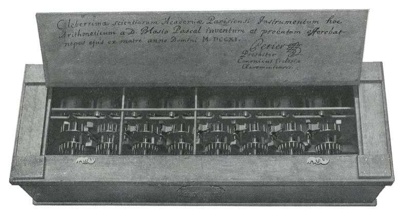

   The Pascaline (c. 1642) — Pascal's eight-digit mechanical adder.  Its
   carry mechanism introduced the principle of complement arithmetic still used
   in modern CPUs.
   *Source:* J. A. V. Turck, *Origin of Modern Calculating Machines*, 1921 /
   `Wikimedia Commons <https://commons.wikimedia.org/wiki/File:Pascaline_calculator.jpg>`__,
   Public Domain.

Blaise Pascal built his *Pascaline* around 1642, at the age of nineteen, to
help his father — a tax collector in Rouen — manage the tedious arithmetic of
his work. The machine used interlocking gear wheels with a carry mechanism to
add numbers up to eight digits. Pascal eventually built fifty Pascalines. The
device introduced a principle still central to modern computers: subtraction
performed by adding the nine's complement of the subtrahend. What looks like
subtraction is actually addition with a cleverly disguised operand — a
technique computers use to this day in the form of two's complement arithmetic.

.. index::
   single: Leibniz, Gottfried Wilhelm; Stepped Drum Calculator
   Stepped Drum Calculator

Leibniz's Stepped Drum Calculator
^^^^^^^^^^^^^^^^^^^^^^^^^^^^^^^^^^^^

.. figure:: ../_static/images/computing_history/leibniz.jpg
   :width: 200px
   :alt: Portrait of Gottfried Wilhelm Leibniz, c. 1695

   Gottfried Wilhelm Leibniz (c. 1695), mathematician and inventor of the
   Stepped Drum Calculator.
   *Source:* Christoph Bernhard Francke /
   `Wikimedia Commons <https://commons.wikimedia.org/wiki/File:Christoph_Bernhard_Francke_-_Bildnis_des_Philosophen_Leibniz_(ca._1695).jpg>`__,
   Public Domain.

Gottfried Wilhelm Leibniz extended Pascal's design with the Stepped Drum
Calculator, which could perform not just addition but multiplication and
division through repeated additions. The stepped drum — a cylinder with teeth of
varying lengths — became the basis of mechanical calculators for the next two
centuries.

Communications and the Information Age
---------------------------------------

.. index:: homing pigeons; long-range communication

Homing Pigeons
^^^^^^^^^^^^^^^^

.. figure:: ../_static/images/computing_history/carrier_pigeons.jpg
   :width: 400px
   :alt: WWI mobile carrier pigeon station with soldiers and pigeon lofts, c. 1917–1918

   A mobile carrier pigeon station, Western Front, c. 1917–1918 — pigeons
   remained a critical long-range communication technology through both World Wars.
   *Source:* U.S. War Department /
   `Wikimedia Commons <https://commons.wikimedia.org/wiki/File:Mobile_carrier_pigeons_station_-_NARA_-_17391470.jpg>`__,
   Public Domain (NARA).

Calculating is only half the problem; the other half is communicating results
across distance. Persian trainers pioneered the use of homing pigeons for
long-range message delivery. The Greeks used pigeons to carry the names of
Olympic victors to their home cities. Pigeons were still in active military use
during the Siege of Paris in 1870–71 and were officially discontinued as a
communication technology only around 1910.

.. index::
   single: Morse, Samuel F.B.; telegraph
   telegraph; history
   Morse code
   Associated Press; telegraph origins

Samuel Morse and the Telegraph
^^^^^^^^^^^^^^^^^^^^^^^^^^^^^^^^

.. figure:: ../_static/images/computing_history/samuel_morse.jpg
   :width: 200px
   :alt: Portrait of Samuel F.B. Morse, c. 1855–1865, by Mathew Brady

   Samuel F.B. Morse (c. 1855–1865) — painter turned inventor whose
   telegraph and dot-dash code transformed long-distance communication.
   *Source:* Mathew Brady /
   `Wikimedia Commons <https://commons.wikimedia.org/wiki/File:Samuel_Morse_portrait.jpg>`__,
   Public Domain.

   The International Morse Code — dots and dashes assigned to each letter
   and digit, with common letters receiving the shortest sequences.
   *Source:* Rhey T. Snodgrass & Victor F. Camp (1922) /
   `Wikimedia Commons <https://commons.wikimedia.org/wiki/File:International_Morse_Code.svg>`__,
   Public Domain.

Samuel F.B. Morse (1791–1872) began his career as a painter — a Yale graduate
who moved to New York in 1823 and became one of the foremost American artists
of his day. A chance shipboard conversation about electromagnetism in 1832
redirected his life. Morse reasoned that if electricity could be made visible at
any point in a circuit, intelligence could be transmitted instantaneously to any
distance. He was right. His telegraph, patched together from an artist's canvas
frame and salvaged hardware, sent its first long-distance message in 1844.

The code Morse devised assigned sequences of dots and dashes to each letter,
with common letters receiving shorter codes. Its impact was immediate and
transformative. By 1846 the telegraph was coordinating reports of the Mexican
War. In 1848 six New York newspapers pooled their telegraph costs to form what
became the Associated Press. By the 1850s the Erie Railroad was using it to
manage tracks, switches, freight, and personnel across a dispersed enterprise —
foreshadowing what we now call networked information systems. In 1858 the first
transatlantic cable was laid, though it took twenty-six hours for the first
message to cross; a more reliable cable followed in 1866. By 1864 telegraph
intelligence gave the Union Army a decisive advantage in the Civil War.

Looms and Mechanical Computing
-------------------------------

.. index::
   Jacquard loom
   single: Jacquard, Joseph Marie; loom
   punched cards; Jacquard loom origins

The Jacquard Loom
^^^^^^^^^^^^^^^^^^

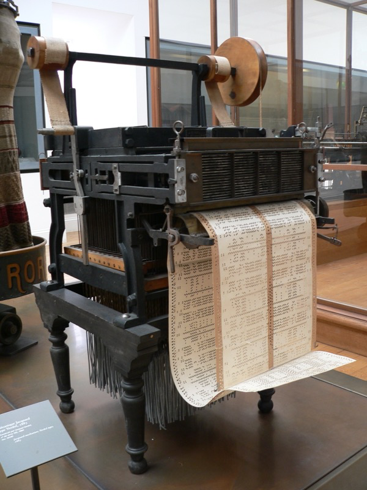

   A Jacquard loom (c. 1804) at the Musée des Arts et Métiers, Paris. The chain
   of punched cards at top encodes the weaving pattern — effectively a program.
   *Source:* David Monniaux / `Wikimedia Commons <https://commons.wikimedia.org/wiki/File:Jacquard_loom_p1040320.jpg>`__,
   CC BY-SA 3.0.

In 1804, the French silk weaver Joseph Marie Jacquard introduced a loom
controlled by chains of punched cards. Each card encoded one row of a woven
pattern: a hole in a given position allowed a hook to pass through and raise the
corresponding warp thread; a solid position blocked the hook. The sequence of
cards constituted, in effect, a program. The connection to computing was not
lost on later inventors: Babbage explicitly acknowledged the Jacquard loom as an
inspiration for his Analytical Engine, and Herman Hollerith's punched cards for
the 1890 census carried the same principle into data processing.

.. index::
   single: Babbage, Charles; Difference Engine
   single: Babbage, Charles; Analytical Engine
   single: Lovelace, Ada; first algorithm
   Difference Engine
   Analytical Engine
   Ada programming language; Lovelace

Charles Babbage and Ada Lovelace
^^^^^^^^^^^^^^^^^^^^^^^^^^^^^^^^^^

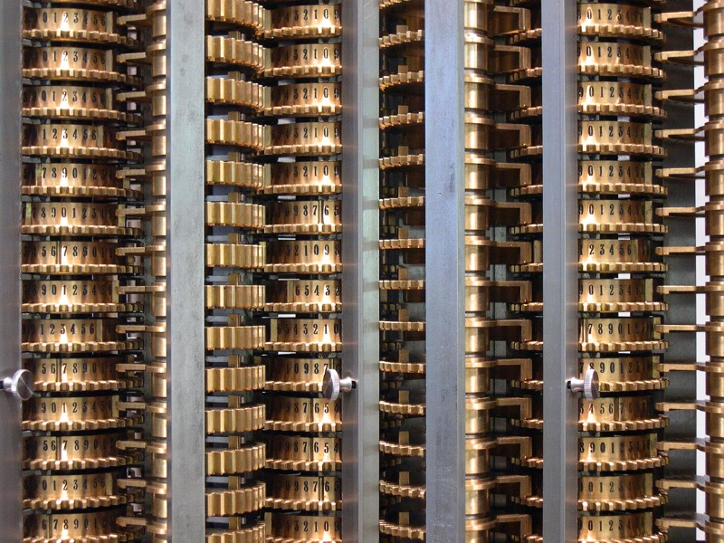

   Babbage's Difference Engine No. 2 — the Science Museum London's 1991
   reconstruction, built from Babbage's original drawings. It computed correctly
   to 31 digits on the first try.
   *Source:* Carsten Ullrich / `Wikimedia Commons <https://commons.wikimedia.org/wiki/File:LondonScienceMuseumsReplicaDifferenceEngine.jpg>`__,
   CC BY-SA 2.5.

Charles Babbage designed two mechanical computing engines of extraordinary
ambition. The Difference Engine, designed in the 1820s, was intended to compute
and print mathematical tables automatically, eliminating the errors that
human *computers* introduced when calculating logarithm and trigonometry tables
by hand. A working Difference Engine was not actually constructed until 1991,
when the Science Museum in London built one from Babbage's original drawings and
found that it worked correctly to 31 digits.

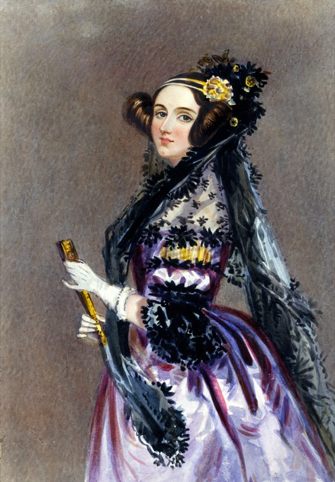

   Ada Lovelace (c. 1840), painted by Alfred Edward Chalon. Her annotated
   translation of Menabrea's account of the Analytical Engine is recognized as
   the first algorithm intended for machine execution.
   *Source:* Alfred Edward Chalon / `Wikimedia Commons <https://commons.wikimedia.org/wiki/File:Ada_Lovelace_portrait.jpg>`__,
   Public Domain.

Babbage's more ambitious Analytical Engine went further still: it was designed
to be programmable, with a separate store (memory), a mill (processor), input
via punched cards, and printed output. Ada Lovelace, who translated an Italian
engineer's account of the Analytical Engine and added notes longer than the
original text, is credited with writing what is recognized as the first
algorithm intended for machine execution. The Ada programming language, used
today in safety-critical systems, is named in her honor.

.. index::
   single: Hollerith, Herman; 1890 census
   punched cards; Hollerith tabulator
   IBM; origins

Herman Hollerith and the 1890 Census
^^^^^^^^^^^^^^^^^^^^^^^^^^^^^^^^^^^^^^

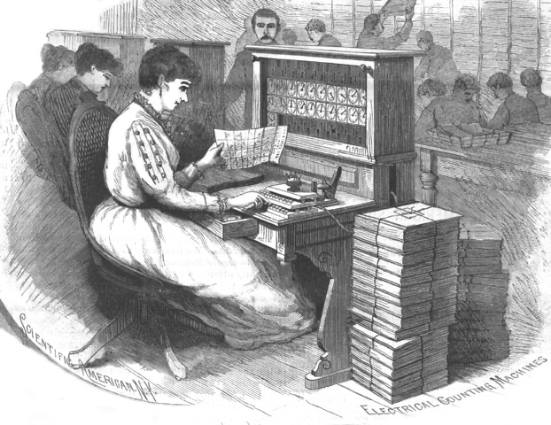

   Hollerith's electrical tabulating machines in operation, as illustrated in
   *Scientific American*, August 30, 1890. His company eventually became IBM.
   *Source:* Uncredited illustrator / `Wikimedia Commons <https://commons.wikimedia.org/wiki/File:1890_Census_Hollerith_Electrical_Counting_Machines_Sci_Amer.jpg>`__,
   Public Domain.

By 1880 the United States Census Bureau faced a crisis: it had taken nearly a
decade to tabulate the previous census by hand, and the 1890 population would
be even larger. Herman Hollerith, a statistician, devised a system of punched
cards and electromechanical tabulating machines that reduced the count to a
matter of weeks. The holes in each card were sensed by pins that dipped into
mercury, completing electrical circuits that advanced counters. Hollerith's
company eventually became part of IBM. The punched card he invented remained a
primary medium for data entry into computers well into the 1970s.

Early Electronic Computing
---------------------------

.. index::
   single: Atanasoff, John Vincent; ABC computer
   single: Berry, Clifford; ABC computer
   Atanasoff-Berry Computer; binary arithmetic

The Atanasoff-Berry Computer
^^^^^^^^^^^^^^^^^^^^^^^^^^^^^

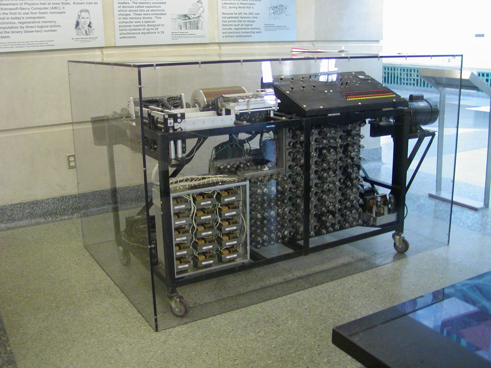

   Reconstruction of the Atanasoff-Berry Computer (ABC) at Iowa State
   University's Durham Center — the first electronic digital computing device,
   built between 1937 and 1942.
   *Source:* Manop /
   `Wikimedia Commons <https://commons.wikimedia.org/wiki/File:Atanasoff-Berry_Computer.jpg>`__,
   CC BY-SA 3.0.

Before the better-known wartime machines, John Vincent Atanasoff and his
graduate student Clifford Berry built the first electronic digital computing
device at Iowa State College between 1937 and 1942. The Atanasoff-Berry
Computer (ABC) was not programmable in the modern sense. However, its ability
to focus on simultaneous linear equations strongly implies the ability to perform
general arithmetic and logic, and it certainly pioneered many ideas — including
the use of binary arithmetic (which was notably absent from the later ENIAC) and
the use of electronic switches (vacuum tubes) rather than mechanical gears to
perform calculation. The ABC also introduced regenerative capacitor memory to
hold intermediate results. Although the machine was never
fully completed and was largely forgotten for decades, a landmark 1973 U.S.
federal court ruling invalidated the ENIAC patent and recognized Atanasoff as
the originator of several foundational computing concepts.

.. index::
   single: Zuse, Konrad; Z3
   Z3; first Turing-complete computer

Konrad Zuse and the Z3
^^^^^^^^^^^^^^^^^^^^^^^^

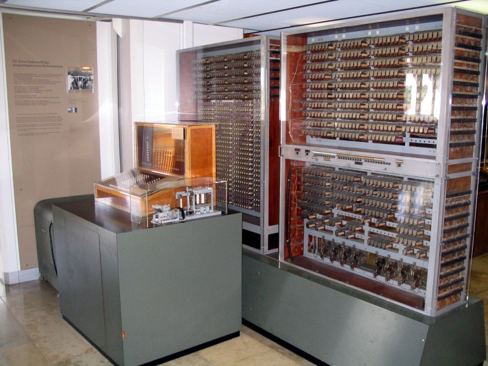

   Reconstruction of Konrad Zuse's Z3 (1941) at the Deutsches Museum, Munich —
   the first Turing-complete programmable computer. The original was destroyed
   in a 1943 Allied bombing raid.
   *Source:* Venusianer / `Wikimedia Commons <https://commons.wikimedia.org/wiki/File:Z3_Deutsches_Museum.JPG>`__,
   CC BY-SA 3.0.

The German engineer Konrad Zuse built the Z3 in 1941 — the first
Turing-complete programmable computer. It used binary arithmetic and was
programmed via punched film tape. Zuse worked largely in isolation, unaware of
parallel developments in Britain and the United States. The Z3 was destroyed in
a 1943 Allied bombing raid; a reconstruction now stands in the Deutsches Museum
in Munich.

.. index:: Colossus; Bletchley Park, Bletchley Park; Colossus, Lorenz machine; Colossus

Colossus at Bletchley Park
^^^^^^^^^^^^^^^^^^^^^^^^^^^^

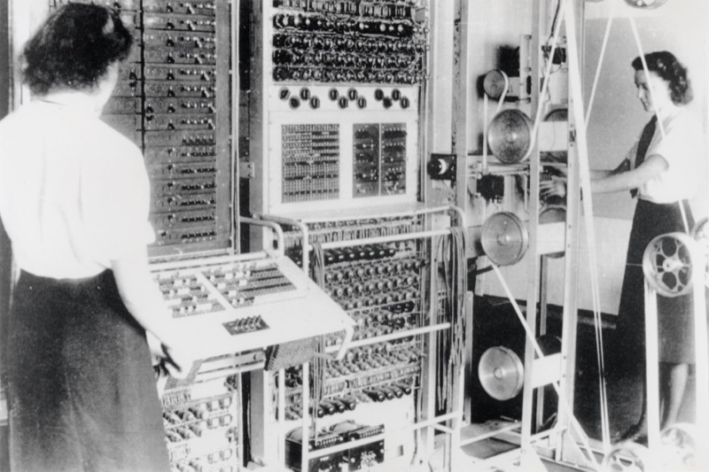

   Colossus (1944) at Bletchley Park — the world's first electronic, digital,
   programmable computer. Its existence was classified until the 1970s.
   *Source:* The National Archives (UK), ref. FO850/234 /
   `Wikimedia Commons <https://commons.wikimedia.org/wiki/File:Colossus.jpg>`__,
   Public Domain.

In Britain, the urgent need to break German military codes drove the development
of Colossus — the world's first electronic, digital, programmable computer,
built at Bletchley Park and operational by 1944. Colossus was designed to crack
messages encrypted by the Lorenz machine, the cipher teleprinter used by the
German High Command. Its existence was kept secret until the 1970s, which
obscured its place in computing history for decades.

.. index::
   ENIAC; University of Pennsylvania
   single: Eckert, J. Presper; ENIAC
   single: Mauchly, John; ENIAC
   single: Jennings, Jean; ENIAC programmer
   single: Holberton, Betty; ENIAC programmer
   single: Bilas, Frances; ENIAC programmer
   single: Lichterman, Ruth; ENIAC programmer
   single: McNulty, Kathleen; ENIAC programmer
   single: Wescoff, Marlyn; ENIAC programmer

ENIAC and the Women Who Programmed It
^^^^^^^^^^^^^^^^^^^^^^^^^^^^^^^^^^^^^^^

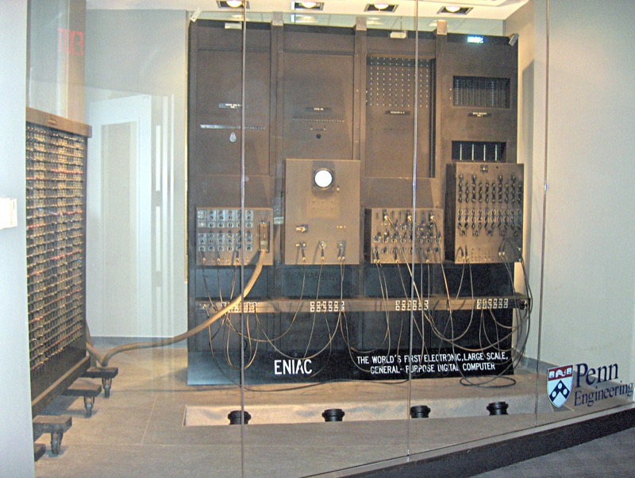

   ENIAC (1945) on display at the University of Pennsylvania — the room-filling
   machine that could perform thousands of arithmetic operations per second.
   *Source:* Paul W. Shaffer / `Wikimedia Commons <https://commons.wikimedia.org/wiki/File:ENIAC_Penn1.jpg>`__,
   CC BY-SA 3.0.

The ENIAC — Electronic Numerical Integrator and Computer — was built at the
University of Pennsylvania by J. Presper Eckert and John Mauchly and became
operational in 1945. Filling a room and consuming 150 kilowatts of power, it
could perform thousands of arithmetic operations per second, far faster than any
mechanical device.

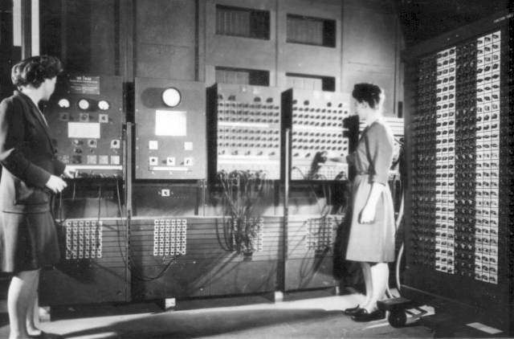

   Betty Jennings (left, later Jean Bartik) and Frances Bilas (right, later
   Frances Spence) at the ENIAC main control panel, Moore School of Engineering,
   c. 1945–1947.
   *Source:* United States Army /
   `Wikimedia Commons <https://commons.wikimedia.org/wiki/File:Two_women_operating_ENIAC.gif>`__,
   Public Domain.

What is less often celebrated is that the programming and
wiring of computations on the ENIAC was carried out by six women: Jean Jennings,
Frances Bilas, Betty Holberton, Ruth Lichterman, Kathleen McNulty, and Marlyn
Wescoff. Working from mathematical problem descriptions and wiring diagrams, they
developed the techniques of programming as we understand them today.

.. index:: UNIVAC; 1952 presidential election, CBS; UNIVAC prediction

UNIVAC and the 1952 Election
^^^^^^^^^^^^^^^^^^^^^^^^^^^^^^

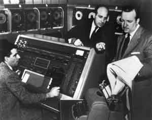

   UNIVAC I on election night, November 4, 1952 — with Walter Cronkite (center)
   and engineers J. Presper Eckert and Harold Sweeny. The machine correctly
   predicted an Eisenhower landslide that CBS initially refused to air.
   *Source:* U.S. Census Bureau /
   `Wikimedia Commons <https://commons.wikimedia.org/wiki/File:UNIVAC_1_demo.jpg>`__,
   Public Domain.

The UNIVAC II, the commercial successor to the ENIAC era, entered public
consciousness in a striking way: CBS used it to predict the outcome of the 1952
presidential election. The machine's projection of an Eisenhower landslide —
based on early returns — was so at odds with conventional wisdom that CBS
initially declined to broadcast it. The machine was right.

.. index::
   single: Bush, Vannevar; memex
   memex; hypertext precursor
   "As We May Think"; Bush 1945
   World Wide Web; Bush's vision

"As We May Think" and the World Wide Web
-----------------------------------------

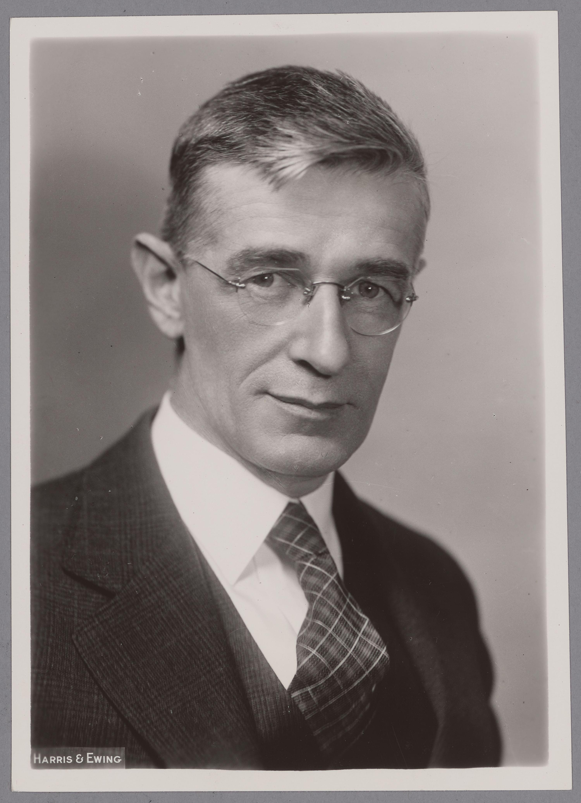

   Vannevar Bush (1938), Director of the Office of Scientific Research and
   Development — whose 1945 essay "As We May Think" envisioned the memex,
   a precursor to the World Wide Web.
   *Source:* Harris & Ewing /
   `Wikimedia Commons <https://commons.wikimedia.org/wiki/File:Vannevar_Bush,_1938,_Harris_%26_Ewing_original.jpg>`__,
   Public Domain.

While engineers were building the first electronic machines, a visionary
government scientist named Vannevar Bush was looking further ahead. In a
landmark 1945 essay in *The Atlantic Monthly*, titled "As We May Think," Bush
described a hypothetical device he called the **memex** — short for *memory
extender*. Bush was Director of the Office of Scientific Research and
Development (the precursor to NSF and ARPA) and had coordinated the United
States' vast wartime scientific effort. He worried that humanity's store of
knowledge had grown so large that no individual could find what was relevant to
their work, and he proposed a solution:

   *Consider a future device for individual use, which is a sort of
   mechanized private file and library... A memex is a device in which an
   individual stores all his books, records, and communications, and which is
   mechanized so that it may be consulted with exceeding speed and flexibility.*

The memex would allow users to link related records together, creating personal
trails of association through accumulated knowledge. Bush's vision looks
remarkably like the World Wide Web: a device through which documents are linked,
searched, and traversed at will. Decades of work on hypertext and networked
computing were required to realize it, and Bush himself believed that much of
his vision remained unachieved even late in his life.

Stored Program and Universal Computing
----------------------------------------

.. index::
   single: Turing, Alan; Turing machine
   Turing machine; universal
   Turing-complete; Python
   Turing-equivalent

The Universal Turing Machine
^^^^^^^^^^^^^^^^^^^^^^^^^^^^^

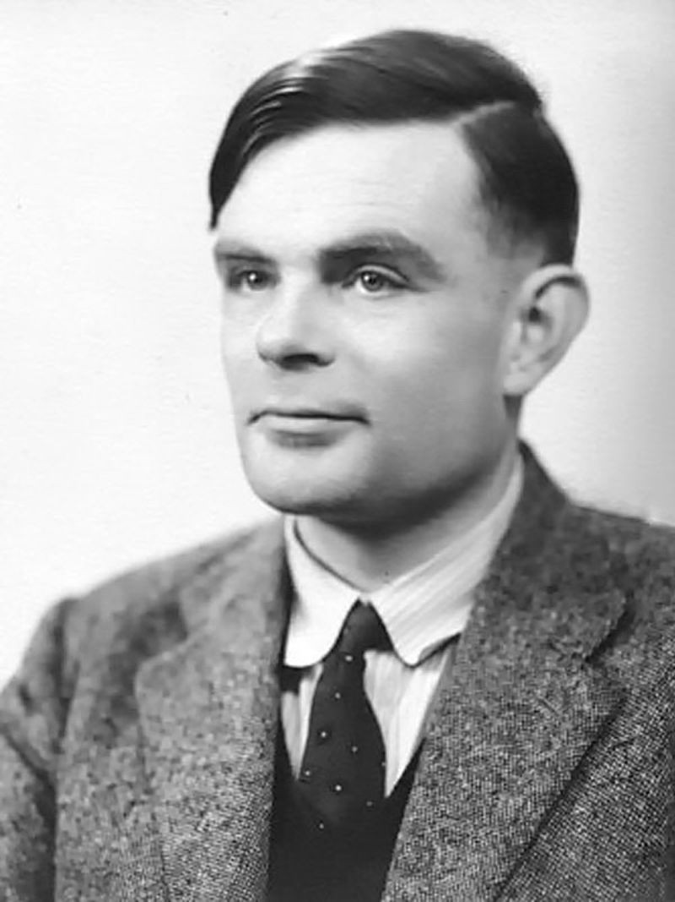

   Alan Turing (1912–1954), photographed in 1951 by Elliott & Fry. His 1936
   paper created theoretical computer science before electronic computers existed.
   *Source:* Elliott & Fry / `Wikimedia Commons <https://commons.wikimedia.org/wiki/File:Alan_Turing_(1951).jpg>`__,
   Public Domain.

In 1936, a young Cambridge mathematician named Alan Turing published a paper
that created theoretical computer science before electronic computers existed.
Turing proposed an abstract machine — now called the Turing machine — consisting
of an infinite tape divided into cells, a read/write head that could move one
cell at a time, and a finite table of instructions. The machine could be made to
simulate any other such machine by loading the appropriate instructions onto its
tape: hence the *universal* Turing machine.

Every programming language in use today, including Python, is Turing-equivalent:
any computation that a Turing machine can perform, they can perform, and vice
versa. Turing also contributed directly to the war effort — his work at
Bletchley Park on breaking the Enigma cipher is credited with significantly
shortening the conflict. Despite this, he was prosecuted in 1952 for his
homosexuality, subjected to chemical castration, and died in 1954. He was
posthumously pardoned by the British government in 2013 and granted a statutory
pardon in 2017.

.. index::
   single: von Neumann, John; architecture
   von Neumann architecture
   stored-program concept

John von Neumann and the Architecture of Modern Computers
^^^^^^^^^^^^^^^^^^^^^^^^^^^^^^^^^^^^^^^^^^^^^^^^^^^^^^^^^^

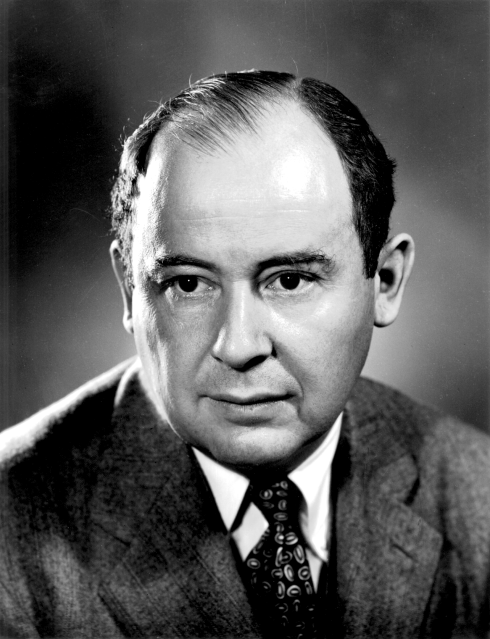

   John von Neumann at Los Alamos, c. 1940s. His 1945 EDVAC report described
   the arithmetic unit, control unit, and memory architecture that every
   computer still uses today.
   *Source:* Los Alamos National Laboratory /
   `Wikimedia Commons <https://commons.wikimedia.org/wiki/File:JohnvonNeumann-LosAlamos.gif>`__,
   Public Domain.

While Turing provided the theoretical foundation, John von Neumann provided the
architectural blueprint. Von Neumann was a polymath of extraordinary range —
contributing to mathematics, physics, game theory, and economics — and was
involved in the Manhattan Project before turning his attention to computing. In
1945 he circulated a draft report on the EDVAC (the successor to the ENIAC)
that articulated three ideas that have shaped every computer built since:

First, the device must perform the elementary operations of arithmetic. Second,
the logical control of the device is the proper sequencing of its operations by
a control organ. Third, any device intended to carry out long and complicated
sequences of operations must have a considerable memory.

These three elements — arithmetic unit, control unit, and memory — constitute
what we call the von Neumann architecture. The machine you are reading this on,
regardless of its physical form, is a realization of this architecture. The
stored-program concept — the idea that instructions and data can live in the
same memory, allowing the machine to treat its own program as data and modify it
— turned a specialized calculator into a general-purpose tool.

Further Reading
---------------

The following works informed this chapter and are recommended for anyone who
wishes to explore computing history further.

- Vanevar Bush, "As We May Think," *The Atlantic Monthly*, July 1945.
- Paul E. Ceruzzi, *A History of Modern Computing*, 2nd Edition.
- Gareth Cook, "Untangling the Mystery of the Inca," *Wired*, January 2007.
- Gerald Holzmann and Björn Pehrson, *The Early History of Data Networks*.
- Georges Ifrah, *Universal History of Computing: From Abacus to Quantum Computer*.
- Howard Rheingold, *Tools for Thought: The History and Future of Mind-Expanding Technology*.
- Simon Singh, *The Code Book: The Science of Secrecy from Ancient Egypt to Quantum Cryptography*.
- Thomas J. Bergin, American University Computing History Museum.
