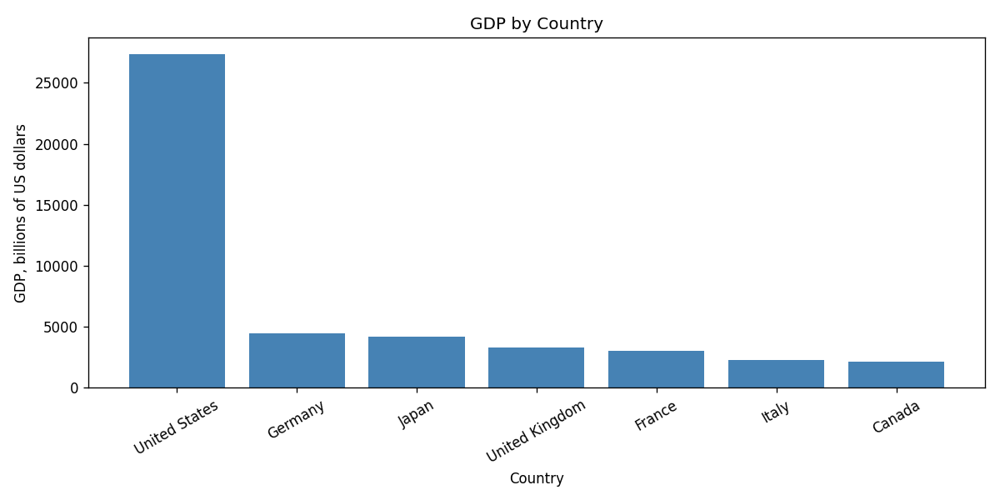

.. index:: pandas, DataFrame, data analysis, matplotlib; bar chart
   ACM-IEEE CS2013; IM1 Information Management Concepts
   ACM-IEEE CS2023; IM1 Information Management Concepts
   ACM-IEEE CS2013; SDF2 Fundamental Programming Concepts
   ACM-IEEE CS2023; SDF2 Fundamental Programming Concepts

.. _Data-Analysis-With-Pandas:

Data Analysis with Pandas
=========================

.. note::

   *Source:* Adapted from COMP 180 course notebooks developed by George K.
   Thiruvathukal, Daniel Henriques Moreira, and Mohammed Abuhamad.  Rewritten
   for this book as regular Python examples and Sphinx code blocks rather than
   Jupyter notebooks.

Many useful programs work with **tabular data**: rows and columns of
related values.  A spreadsheet is tabular data.  So is a CSV file, a
database query result, and many web API responses.  Earlier chapters
showed how to represent records with dictionaries and collections of
records with :ref:`lists of dictionaries <Lists-Of-Dictionaries>`.  The
``pandas`` library builds on those ideas and gives you a higher-level
object, the **DataFrame**, for working with whole tables at once.

This chapter introduces just enough pandas to make the later data case
studies easier to read.  You will create a DataFrame, select rows and
columns, sort and filter data, group rows, compute summary statistics,
and make a first chart with ``matplotlib``.

Install pandas and matplotlib if needed:

.. code-block:: none

   pip install pandas matplotlib

Creating a DataFrame
--------------------

A DataFrame can be built from a list of dictionaries.  Each dictionary
describes one row.  The dictionary keys become column names:

.. literalinclude:: ../../examples/introcs-python/data_analysis/countries.py
   :language: python
   :start-after: # start: countries_data
   :end-before: # end: countries_data

The following function converts that list into a DataFrame and uses the
``"Country"`` column as the row index:

.. literalinclude:: ../../examples/introcs-python/data_analysis/countries.py
   :language: python
   :start-after: # start: create_dataframe
   :end-before: # end: create_dataframe

The index is the label pandas uses for each row.  A meaningful index
lets you ask for rows by name instead of by position.

.. code-block:: python

   countries = create_country_dataframe()
   print(countries)

Output:

.. code-block:: none

                         Continent  Population    GDP     Area    HDI
   Country
   Canada            North America        38.8   2140  9984670  0.936
   France                   Europe        68.0   3030   551695  0.910
   Germany                  Europe        84.4   4450   357114  0.950
   Italy                    Europe        58.9   2300   301340  0.906
   Japan                      Asia       124.5   4210   377975  0.925
   United Kingdom           Europe        67.7   3340   243610  0.940
   United States     North America       334.9  27360  9833517  0.927

Summary Statistics
------------------

``describe`` gives a quick numerical summary of every numeric column:

.. code-block:: python

   print(countries.describe())

Output:

.. code-block:: none

          Population           GDP          Area       HDI
   count    7.000000      7.000000  7.000000e+00  7.000000
   mean   111.028571   6690.000000  3.092846e+06  0.927714
   std    102.202539   9156.141837  4.657552e+06  0.015861
   min     38.800000   2140.000000  2.436100e+05  0.906000
   25%     63.300000   2665.000000  3.292270e+05  0.917500
   50%     68.000000   3340.000000  3.779750e+05  0.927000
   75%    104.450000   4330.000000  5.192606e+06  0.938000
   max    334.900000  27360.000000  9.984670e+06  0.950000

This is often the first thing to do after loading unfamiliar data.  It
shows the count, average, spread, and range of the numeric columns.  It
can also reveal suspicious values: a population of zero, a negative
area, or a missing column that did not load as a number.

Selecting Rows and Columns
--------------------------

There are three common selection patterns.

Use square brackets with column names to select columns:

.. code-block:: python

   print(countries[["Population", "GDP"]])

Output:

.. code-block:: none

                   Population    GDP
   Country
   Canada                38.8   2140
   France                68.0   3030
   Germany               84.4   4450
   Italy                 58.9   2300
   Japan                124.5   4210
   United Kingdom        67.7   3340
   United States        334.9  27360

Use ``loc`` to select by row and column labels:

.. code-block:: python

   print(countries.loc[["France", "Japan"], ["Population", "GDP"]])

Output:

.. code-block:: none

            Population   GDP
   Country
   France         68.0  3030
   Japan         124.5  4210

Use ``iloc`` to select by integer position:

.. code-block:: python

   print(countries.iloc[0:3])

Output:

.. code-block:: none

                    Continent  Population   GDP     Area    HDI
   Country
   Canada       North America        38.8  2140  9984670  0.936
   France              Europe        68.0  3030   551695  0.910
   Germany             Europe        84.4  4450   357114  0.950

The distinction matters.  ``loc`` uses names from the DataFrame's
index and columns.  ``iloc`` uses zero-based positions, like list
indexing.

Filtering and Sorting
---------------------

Filtering keeps only rows that satisfy a condition.  This expression
keeps countries whose population is at least 60 million:

.. code-block:: python

   large = countries[countries["Population"] >= 60]
   print(large.sort_values("Population", ascending=False))

Output:

.. code-block:: none

                         Continent  Population    GDP     Area    HDI
   Country
   United States     North America       334.9  27360  9833517  0.927
   Japan                      Asia       124.5   4210   377975  0.925
   Germany                  Europe        84.4   4450   357114  0.950
   France                   Europe        68.0   3030   551695  0.910
   United Kingdom           Europe        67.7   3340   243610  0.940

The expression ``countries["Population"] >= 60`` produces a column of
``True`` and ``False`` values.  Passing that column back into
``countries[...]`` keeps the rows where the value is ``True``.  This is
called **boolean indexing**.

Grouping Rows
-------------

Grouping collects rows that share a value, then computes something for
each group.  Here we group countries by continent and compute the mean
population and GDP:

.. literalinclude:: ../../examples/introcs-python/data_analysis/countries.py
   :language: python
   :start-after: # start: filter_sort_group
   :end-before: # end: filter_sort_group

.. code-block:: python

   summary = summarize_countries(countries)
   print(summary)

Output:

.. code-block:: none

                  Population      GDP
   Continent
   North America      186.85  14750.0
   Asia               124.50   4210.0
   Europe              69.75   3280.0

The expression ``df.groupby("Continent")[["Population", "GDP"]].mean()``
means: split the rows by continent, keep the population and GDP
columns, and compute the mean for each group.

Plotting a Bar Chart
--------------------

Tables are precise, but charts make patterns easier to see.  The
``matplotlib`` library is commonly used with pandas for plotting:

.. literalinclude:: ../../examples/introcs-python/data_analysis/countries.py
   :language: python
   :start-after: # start: plot_gdp
   :end-before: # end: plot_gdp

.. code-block:: python

   plot_gdp(countries, "country_gdp.png")

Output:

.. code-block:: none

   Saved country_gdp.png

   GDP by country for the sample DataFrame.

The chart code follows the same structure you will see in later case
studies: create a figure and axes, draw the chart, label the axes,
tighten the layout, save the image, and close the figure.

Reading Data from CSV
---------------------

Most real data will come from a file rather than a list written inside
your program.  The ``read_csv`` function loads a CSV file directly into
a DataFrame:

.. code-block:: python

   countries = pd.read_csv("countries.csv")
   countries = countries.set_index("Country")

Once the data is loaded, the same operations apply: ``describe``,
column selection, ``loc``, ``iloc``, filtering, grouping, and plotting.
That consistency is why pandas is useful.  You can learn a small set of
operations and apply them to many different datasets.

Exercises
---------

1. Add a ``Life Expectancy`` column to the country data.  Use
   ``describe`` to summarize it.

2. Write an expression that selects only countries in Europe.

3. Sort the DataFrame by ``HDI`` from highest to lowest.

4. Group by ``Continent`` and compute the maximum ``HDI`` in each
   group.

5. Modify ``plot_gdp`` to plot population instead of GDP.
