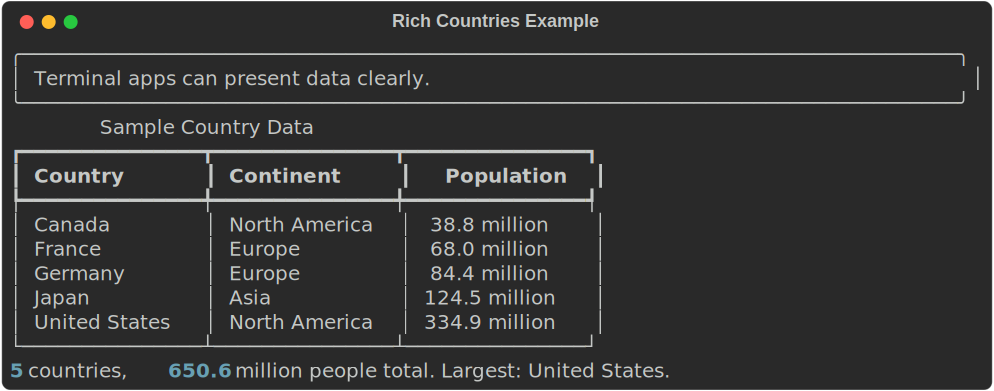
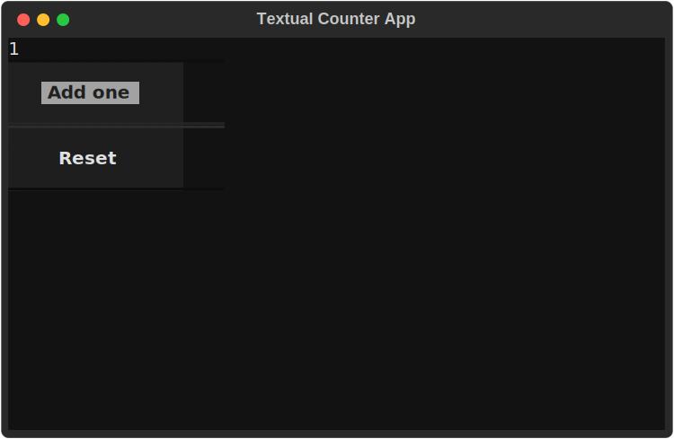

.. index:: TUI, terminal user interface, Rich, Textual, widgets, events,
           agentic systems, AI coding assistants
   ACM-IEEE CS2013; PL3 Event-Driven and Reactive Programming
   ACM-IEEE CS2023; PL3 Event-Driven and Reactive Programming

.. _User-Interfaces:
.. _Terminal-User-Interfaces:

Terminal User Interfaces with Rich and Textual
==============================================

.. note::

   *Source:* Adapted from COMP 501 graphical user interface material
   contributed by PhD students at Loyola University Chicago.  This version
   replaces the original Tkinter desktop examples with terminal user interface
   examples using ``rich`` and ``textual``.

A **Terminal User Interface** (TUI) lets a program interact with users inside
the terminal using layout, color, tables, input controls, and keyboard or mouse
events.  A TUI is still text-based, but it is more structured than a plain
sequence of ``print`` and ``input`` calls.

Terminal interfaces have never disappeared, but they have become newly
important.  Modern software development increasingly happens in remote shells,
containers, cloud workspaces, continuous-integration logs, and command-line
tools that can be scripted and inspected.  At the same time, agentic AI systems
have made the terminal feel current again: tools such as Claude Code and Codex
operate through terminal-centered workflows, reading files, running commands,
editing code, and reporting results without needing a traditional desktop
window.  The terminal is not just a place to type old commands; it is a compact
environment for coordinating programs, data, tests, automation, and human
judgment.

TUIs are common in developer tools, system administration programs, package
managers, monitoring tools, and AI coding assistants.  They fit naturally in
this book because you have already learned the terminal, loops, functions,
files, dictionaries, APIs, and data analysis.  A terminal app can combine those
ideas without requiring a desktop windowing toolkit or a full web stack.

This chapter uses two libraries:

- ``rich`` for formatted terminal output such as tables, panels, progress bars,
  and styled text.
- ``textual`` for full interactive terminal apps with widgets and events.

Install them if needed:

.. code-block:: none

   pip install rich textual

Why Start with a Terminal UI?
-----------------------------

Python includes Tkinter, a long-standing desktop graphical toolkit, and many
projects use browser-based interfaces.  Those are useful options, but they add
extra concerns about windows, browsers, deployment, or front-end code.  A
terminal UI keeps the focus on computing concepts: state, input, output,
events, layout, and user workflow.

That focus is especially useful for beginning programmers.  A terminal UI can
grow directly out of programs you already know how to write: a menu loop, a
table of results, a status message, a filtered dataset, or a command that calls
an API.  The interface becomes a clearer presentation of the program's state
instead of a separate visual world that must be learned all at once.

The progression in this chapter is deliberately simple.  First, use ``rich`` to
make terminal output readable.  Then, use a small ``textual`` app to see how
event-driven programs work.

Formatted Output with Rich
--------------------------

The ``rich`` library improves terminal output while keeping your program close
to ordinary Python.  You can still write functions that return data, then use
``rich`` to display that data clearly.

The example below starts with a familiar structure: a list of dictionaries.
Each dictionary is one record.

.. literalinclude:: ../../examples/introcs-python/ui/rich_countries.py
   :language: python
   :start-after: # start: data
   :end-before: # end: data

To display the records as a table, create a ``Table``, add columns, and then add
one row for each dictionary:

.. literalinclude:: ../../examples/introcs-python/ui/rich_countries.py
   :language: python
   :start-after: # start: table
   :end-before: # end: table

The function does not print directly.  It builds and returns a table object.
That separation keeps the data logic and display logic easy to test.

Adding a Summary
----------------

Terminal apps often combine a table with a short status line or summary.  This
function computes a few simple facts from the same list of dictionaries:

.. literalinclude:: ../../examples/introcs-python/ui/rich_countries.py
   :language: python
   :start-after: # start: summary
   :end-before: # end: summary

The main program creates a ``Console`` and prints a panel, the table, and the
summary:

.. literalinclude:: ../../examples/introcs-python/ui/rich_countries.py
   :language: python
   :start-after: # start: main
   :end-before: # end: main

Run it from the terminal:

.. code-block:: none

   python examples/introcs-python/ui/rich_countries.py

Output:

.. code-block:: none

   Terminal apps can present data clearly.

              Sample Country Data
   Country          Continent       Population
   Canada           North America  38.8 million
   France           Europe         68.0 million
   Germany          Europe         84.4 million
   Japan            Asia           124.5 million
   United States    North America  334.9 million

   5 countries, 650.6 million people total. Largest: United States.

   A Rich terminal display with a panel, table, and summary.

The exact appearance depends on your terminal, but the program structure is
simple: data, table-building function, summary function, and ``main``.

From Menus to Events
--------------------

Earlier interactive programs in this book often used a ``while`` loop:

.. code-block:: python

   choice = ""
   while choice != "q":
       print("a. Add one")
       print("r. Reset")
       print("q. Quit")
       choice = input("Choice: ")

       if choice == "a":
           count += 1
       elif choice == "r":
           count = 0

That pattern is still useful.  A TUI framework changes the shape of the
program: instead of asking for one command at a time, the app waits for events.
An event might be a key press, a button press, or a changed input field.

A Small Textual App
-------------------

``textual`` is a framework for building full terminal apps.  It uses classes
because the app needs to remember state and respond to events.  The example
below keeps the class small: one counter, two buttons, and one display.

.. literalinclude:: ../../examples/introcs-python/ui/textual_counter.py
   :language: python
   :start-after: # start: app
   :end-before: # end: app

Run it from the terminal:

.. code-block:: none

   python examples/introcs-python/ui/textual_counter.py

   A small Textual app after the ``Add one`` button has been pressed.

The important parts are:

- ``compose`` describes what appears on the screen.
- ``on_mount`` initializes the app's state.
- ``on_button_pressed`` responds to button events.
- ``query_one`` finds the display widget so the program can update it.

This is event-driven programming.  The program does not call the event handler
directly.  The framework calls it when the user presses a button.

Keeping TUI Programs Understandable
-----------------------------------

For introductory programs, keep the design modest:

- Put ordinary data work in ordinary functions.
- Use ``rich`` when formatted output is enough.
- Use ``textual`` only when the user needs interactive controls.
- Keep app classes small.
- Avoid mixing data cleaning, analysis, and display code in the same function.

This approach lets you build useful terminal apps without turning every program
into a large object-oriented design.

Where Other Interfaces Fit
--------------------------

TUIs are one kind of user interface, not the only kind.  If your program needs a
desktop window, a graphical toolkit may be a better fit.  If your program needs
to run in a browser, a web app framework may be a better fit.  For example,
``streamlit`` is commonly used for Python data apps and dashboards, ``gradio``
is common for AI model demos, and ``dash`` is often used for more formal
analytical dashboards.

The main idea is transferable: separate the core computation from the user
interface.  A function that filters a DataFrame or computes summary statistics
can be called from a command-line program, a TUI, a web dashboard, or a test.

Exercises
---------

1. Modify ``rich_countries.py`` to add an ``Area`` column to the table.

2. Add a function that filters the country data by continent and displays only
   the matching rows.

3. Change the summary so it reports the average population.

4. Write a Rich program that reads a CSV file with ``pandas`` and displays the
   first ten rows in a table.

5. Modify ``textual_counter.py`` to add a ``Subtract one`` button.

6. Build a small Textual app with an input field and a display area.  When the
   user enters a name, show a greeting.
